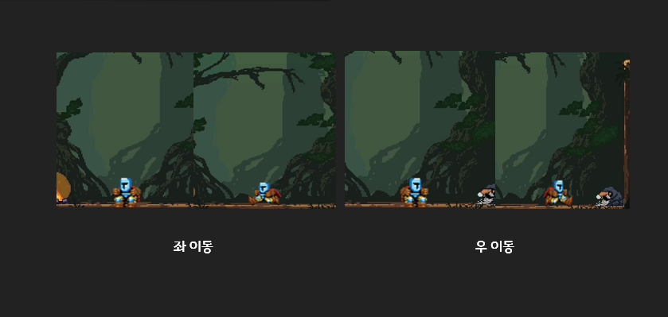

# JumpKing-Game

안녕하세요. 진경빈입니다.
이번에는 2주동안 점프킹을 제작했는데요
어떤 기능들을 구현했는지 알아보도록 하겠습니다

## First Player

### 플레이어의 기능

1. 좌, 우 이동
2. 점프
3. 중력(땅으로 떨어지는 기능)
	이렇게 크게 3가지 입니다
	
####  1. 좌우이동 기능
- 좌, 우 이동 부드럽게
- 좌,우 각각 독립 쓰레드이용
- KeyListener사용

###  2. 점프 기능
- 점프후 방향 조작 불가능
  - 좌우 이동 방지
  - 점프 중복 실행 방지
- 기모은 수치만큼 올라가는 기능
  - MAX 100제한 
- 지형지물 충돌 시 반대방향으로 진행
   - 충돌시 방향값 반전
- 지형지물 충돌 시 속도 감소
  - 충돌시 속도 및 점프게이지 감소
- 일정 높이 이상에서 추락시 추락이미지 설정
- 쓰레드 2개로 구성 (상승,하락)
  + 상승 쓰레드 기능
     + 기모으는 쓰레드
     + 상승 쓰레드
  - 하강 쓰레드 기능
    + 하강

### 3. 중력기능
- 중력 발동시 방향 조작 불가능
  - 게임실행시 중력쓰레드 자동실행
 - 일정 높이 이상에서 추락시 추락이미지 적용
 - 점프의 하강쓰레드와 중력쓰레드 동시실행 방지
   - boolean변수를 하나두어서 구별
  

